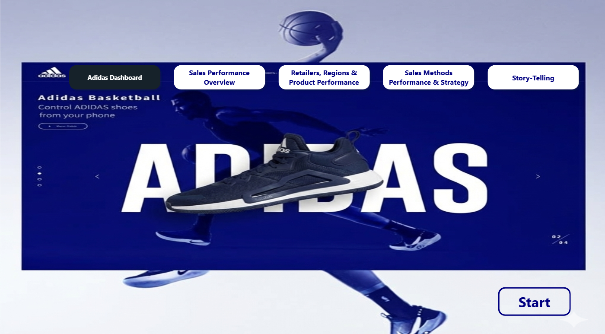
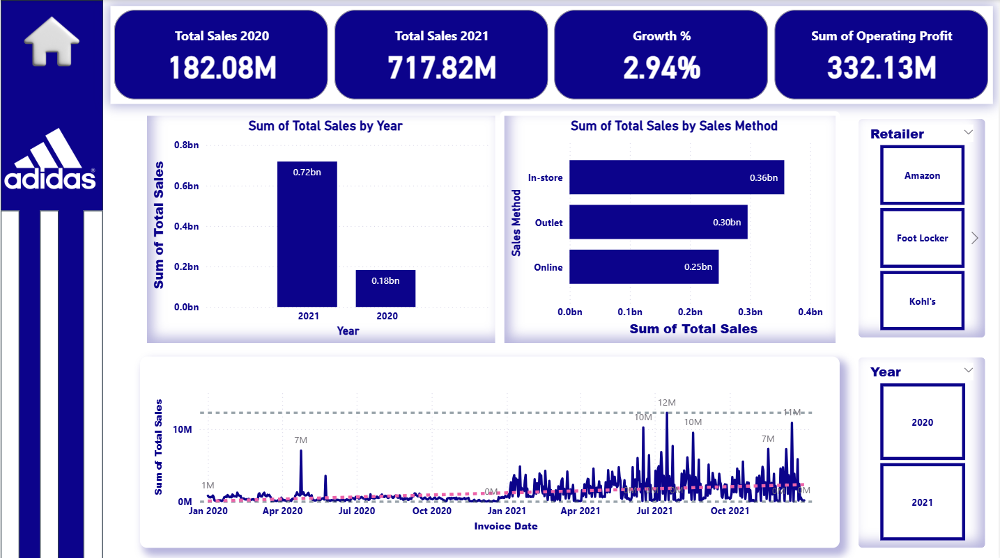
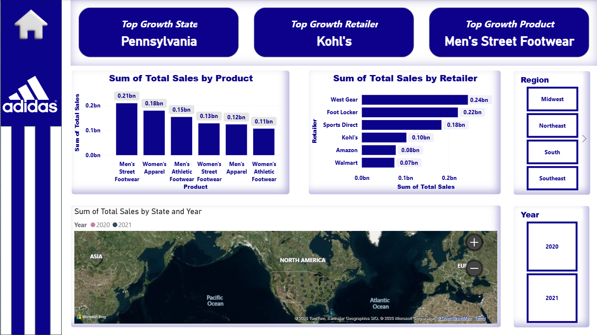
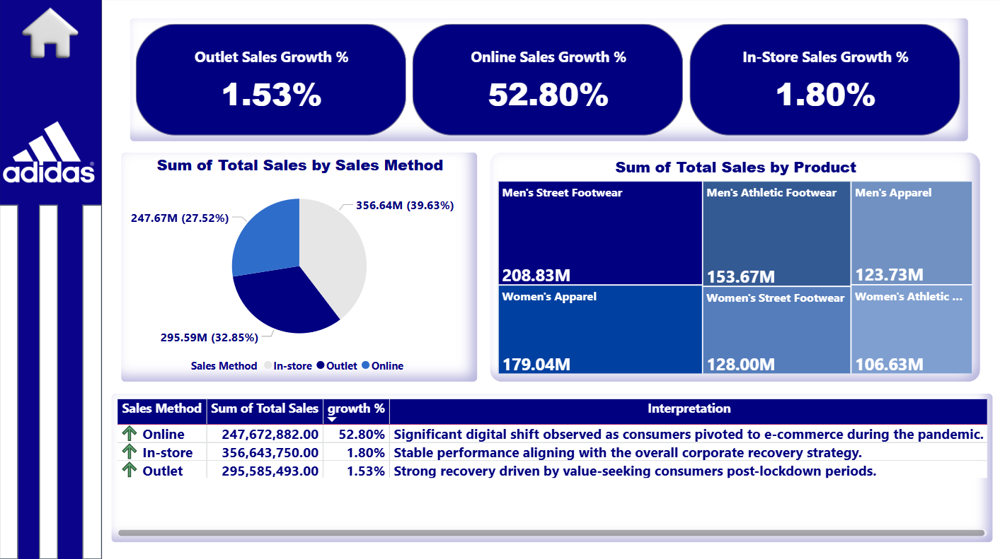

# 👟 Adidas Sales Analysis Dashboard

> An interactive Power BI dashboard analyzing Adidas sales performance across 2020–2021, highlighting growth trends and online channel expansion.

---

## 📊 Dashboard Preview

---

## 🎯 Project Overview

This project analyzes **Adidas sales data** to uncover year-over-year performance trends, evaluate online sales growth, and support data-driven business decisions using visual analytics.

---

## 📈 Key KPIs

| KPI | Description |
|-----|-------------|
| 💰 **Total Sales 2020** | Baseline annual revenue |
| 💰 **Total Sales 2021** | Year-over-year revenue comparison |
| 📈 **Growth %** | Overall sales growth rate |
| 🌐 **Online Sales Growth %** | E-commerce channel performance |

---

## 🛠️ Tools & Technologies

- **Power BI Desktop** — Dashboard design & data visualization
- **Microsoft Excel** — Data cleaning & preparation

---

## 👩‍💻 Author
**Hala Al-Masri**
🎓 Business Intelligence Student — An-Najah National University

